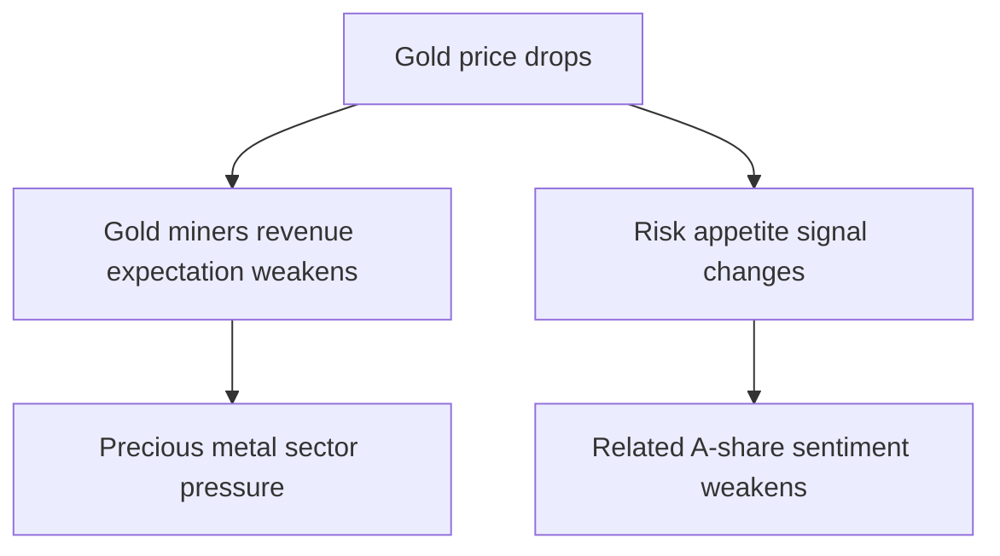

# MarketBot Awesome Finance Skills Integration Plan

## Goal

Absorb the highest-value capabilities from `Awesome-finance-skills` into
`marketbot` without duplicating the existing skill surface.

The integration target is not "copy more skills into `marketbot/skills`".
The target is:

1. strengthen reusable domain/runtime capabilities
2. expose them through a small number of marketbot-native skills
3. preserve MarketBot's current architecture: skill-first, tool-backed,
   explainable, multi-market routing

## Source Assessment

`marketbot` already covers most broad finance skill categories through:

- `market-report`
- `news-intelligence`
- `sentiment-analysis`
- `daily-stock-screener`
- `catalyst-tracker`
- `stock-watch`
- `earnings-readout`
- multiple browser-backed research skills

The strongest incremental value from `Awesome-finance-skills` is concentrated
in four areas:

1. signal lifecycle tracking
2. local intel retrieval / hybrid search
3. stronger sentiment backends
4. logic-chain visualization

The rest is either:

- overlapping orchestration already covered by MarketBot skills
- too heavyweight for the current runtime posture

## Integration Principles

1. Do not mirror AlphaEar skill names one-to-one.
2. Move reusable logic into `domain/` or tool/runtime layers first.
3. Add new skills only when they express a distinct user workflow.
4. Keep optional heavy dependencies isolated behind feature flags.
5. Prefer "degrade clearly" over hidden fallback behavior.

## Capability Decisions

### Adopt Now

#### 1. Signal Tracker

Source:

- `alphaear-signal-tracker`

MarketBot target:

- new skill: `thesis-tracker`
- optional storage model for tracked theses / signals
- scheduler-compatible follow-up workflow

Why it matters:

- fills a real gap in MarketBot's current stack
- turns one-off research into an evolving research object
- composes naturally with `cron`, `market-monitor`, `catalyst-tracker`, and
  `intel-daily-digest`

#### 2. Hybrid Intel Search

Source:

- `alphaear-search`
- local BM25 + vector + RRF retrieval pattern

MarketBot target:

- new `domain/intel/search.py`
- optional tool: `intel_search`
- optional use inside `news-intelligence`, `stock-watch`, and future
  `thesis-tracker`

Why it matters:

- MarketBot already collects intel, but retrieval across prior intel is still
  weak
- this improves continuity across sessions and recurring workflows

#### 3. Sentiment Backend Upgrade

Source:

- `alphaear-sentiment`

MarketBot target:

- optional local FinBERT sentiment backend
- backend selection inside market sentiment tools
- preserve current lightweight lexical fallback

Why it matters:

- current sentiment path is shallow for nuanced finance text
- current A-share / HK social sentiment degrades aggressively when a native
  source is not available

#### 4. Logic Chain Visualizer

Source:

- `alphaear-logic-visualizer`

MarketBot target:

- new skill: `logic-chain-visualizer`
- artifact renderer for transmission chains
- optional downstream use in `market-report`, `news-intelligence`,
  `earnings-readout`

Why it matters:

- highly differentiated output
- useful for event propagation analysis, sector linkage, and macro-to-equity
  reasoning

### Partial Adoption Only

#### 5. News Aggregation Extras

Source:

- `alphaear-news`

Adopt only:

- unified hot-topic aggregation patterns
- optional prediction-market context such as Polymarket

Do not adopt directly:

- parallel local news DB stack as a separate silo
- a second full news skill that overlaps with `news-intelligence`

#### 6. Report Assembly Patterns

Source:

- `alphaear-reporter`

Adopt only:

- report clustering / section assembly ideas
- optional chart-config output patterns

Do not adopt directly:

- a separate generic reporting skill duplicating `market-report`

### Defer

#### 7. Predictor / Kronos Stack

Source:

- `alphaear-predictor`

Reason to defer:

- heavy dependency footprint
- local model and checkpoint management
- architecture mismatch with MarketBot's current lightweight runtime
- high maintenance cost relative to short-term user value

This should only be revisited if MarketBot explicitly moves toward a local
forecasting product line.

## Execution Plan

### Phase 1: Foundation Services

Goal:

- add reusable capabilities without changing the visible skill catalog too much

Work items:

1. Add intel retrieval service
2. Add pluggable sentiment backend selection
3. Add config schema support for optional heavy backends
4. Keep all new paths optional and safe-by-default

Target files:

- `marketbot/domain/intel/`
- `marketbot/agent/tools/market.py`
- `marketbot/config/schema.py`
- `marketbot/config/loader.py`
- `marketbot/skills/sentiment-analysis/SKILL.md`
- `marketbot/skills/news-intelligence/SKILL.md`

Detailed tasks:

#### 1. Intel Search Service

Add:

- `marketbot/domain/intel/search.py`

Responsibilities:

- load recent intel items from current storage
- build BM25 retrieval first
- optionally enable vector retrieval when embedding dependencies are installed
- expose a stable ranked result structure

Suggested API:

```python
class IntelSearchService:
    async def search(
        self,
        query: str,
        *,
        limit: int = 5,
        use_vector: bool = False,
        days: int = 30,
    ) -> list[dict[str, Any]]: ...
```

MVP behavior:

- BM25 only
- no mandatory embedding model
- vector search behind config flag and optional dependency

#### 2. Sentiment Engine Abstraction

Add a small abstraction layer rather than mixing logic directly into tools.

Suggested module:

- `marketbot/domain/market/sentiment.py`

Suggested engines:

- `lexicon`
- `finbert` optional
- `llm` optional future

Suggested API:

```python
class SentimentEngine:
    async def analyze_text(self, text: str) -> dict[str, Any]: ...
```

Tool integration targets:

- `market_event_extract`
- `market_social_sentiment`
- any future headline clustering / scoring flow

#### 3. Config Surface

Add optional config fields such as:

```json
{
  "tools": {
    "market": {
      "sentimentBackend": "lexicon",
      "sentimentModel": "",
      "intelSearch": {
        "enabled": true,
        "vectorEnabled": false,
        "embeddingModel": ""
      }
    }
  }
}
```

Acceptance criteria:

- current default behavior unchanged
- no heavy dependency required for install
- degraded modes are explicit in result metadata or warnings

### Phase 2: New User-Facing Skills

Goal:

- expose genuinely new workflows

Work items:

1. add `thesis-tracker`
2. add `logic-chain-visualizer`
3. optionally add `intel_search` tool if needed for direct invocation

Target files:

- `marketbot/skills/thesis-tracker/SKILL.md`
- `marketbot/skills/logic-chain-visualizer/SKILL.md`
- `marketbot/skills/README.md`
- `marketbot/agent/tools/`
- optional `marketbot/templates/`

#### 1. `thesis-tracker`

Purpose:

- maintain a structured object representing an investment thesis or signal
- compare new facts against prior thesis state
- classify change as `strengthened`, `weakened`, `falsified`, or `unchanged`

Recommended storage shape:

```json
{
  "id": "signal-nvda-ai-capex-001",
  "symbol": "NVDA",
  "thesis": "AI capex cycle remains strong through next two quarters",
  "status": "active",
  "confidence": 0.72,
  "lastUpdateAt": "2026-03-29T00:00:00Z",
  "drivers": [],
  "risks": [],
  "history": []
}
```

Implementation note:

- start file-backed or reuse existing workspace storage patterns
- do not introduce a separate heavy database in the first pass

MVP workflow:

1. create thesis from prompt or existing report
2. fetch new news / market changes
3. compare against thesis
4. store update snapshot
5. generate concise state-transition summary

#### 2. `logic-chain-visualizer`

Purpose:

- convert a reasoning chain into a visual artifact

Recommended first output:

- structured Markdown plus Mermaid graph

Reason:

- lower dependency cost than Draw.io or pyecharts-first integration
- easy to inspect in CLI and saved reports

Possible later output:

- Draw.io XML
- HTML artifact
- chart/image export

MVP output example:

```md
# Logic Chain: Gold Selloff -> A-Share Impact


```

Acceptance criteria:

- skill can be invoked directly
- `news-intelligence` and `market-report` can recommend or call it when useful

### Phase 3: News and Reporting Enhancements

Goal:

- improve signal density in outputs without bloating the runtime

Work items:

1. add prediction-market adapter as optional news enrichment
2. improve report assembly templates
3. optionally surface clustered hot-topic views

Target files:

- `marketbot/domain/market/services.py`
- `marketbot/agent/tools/market.py`
- `marketbot/skills/news-intelligence/SKILL.md`
- `marketbot/skills/market-report/SKILL.md`
- `marketbot/market_reporting.py`

#### 1. Prediction Market Enrichment

Scope:

- optional event-expectation supplement only
- not a primary truth source

Use cases:

- macro event probability framing
- election / rate-path / policy expectation checks
- event uncertainty context in reports

Rules:

- label clearly as prediction-market data
- do not merge into factual news counts
- do not use as the sole basis for directional claims

#### 2. Report Assembly Upgrades

Adopt:

- better section clustering
- optional chart blocks
- clearer fact / inference / risk separation

Do not adopt:

- a second report-generation subsystem that bypasses current reporting flow

### Phase 4: Forecasting Track (Deferred)

This phase is optional and should not start until Phases 1-3 produce clear user
pull.

Entry conditions:

- users repeatedly request forecast curves, not just analysis
- environment can support local model weights
- installation complexity is acceptable

If started, isolate it as:

- new optional extra dependency group
- separate tool and skill pair
- no mandatory dependency path in base install

## Recommended Build Order

Build in this exact order:

1. sentiment backend abstraction
2. intel search service
3. `thesis-tracker`
4. `logic-chain-visualizer`
5. prediction-market enrichment
6. report assembly upgrades
7. forecasting evaluation

Reason:

- phases 1-2 unlock immediate product value
- later steps reuse the new foundations
- this minimizes rework

## File-Level Change Map

### New Files

- `marketbot/domain/intel/search.py`
- `marketbot/domain/market/sentiment.py`
- `marketbot/skills/thesis-tracker/SKILL.md`
- `marketbot/skills/logic-chain-visualizer/SKILL.md`
- optional scripts / references under those skill directories

### Existing Files To Update

- `marketbot/agent/tools/market.py`
- `marketbot/domain/intel/digest.py`
- `marketbot/domain/intel/collector.py`
- `marketbot/config/schema.py`
- `marketbot/config/loader.py`
- `marketbot/skills/README.md`
- `marketbot/skills/news-intelligence/SKILL.md`
- `marketbot/skills/sentiment-analysis/SKILL.md`
- `marketbot/skills/market-report/SKILL.md`
- `marketbot/skills/stock-watch/SKILL.md`

## Risks

### Product Risks

1. Duplicating existing skills under new names
2. Letting AlphaEar-style workflows bypass MarketBot's tool-backed design
3. Overfitting to a local data model that MarketBot does not actually use

### Technical Risks

1. Optional ML dependencies increasing installation friction
2. Vector retrieval introducing latency or model-download failures
3. Storage fragmentation if thesis tracking creates a second workspace silo

### Mitigations

1. Keep one MarketBot-native workflow per user problem
2. make all heavy capabilities optional
3. reuse existing workspace/storage conventions
4. add explicit warnings and fallback traces

## Acceptance Criteria

### Phase 1 Done Means

- MarketBot can search prior collected intel
- sentiment backend is pluggable
- default install still works without new heavy packages

### Phase 2 Done Means

- user can create and update a tracked thesis
- user can request a logic-chain artifact
- both skills appear in `marketbot/skills/README.md`

### Phase 3 Done Means

- reports can optionally include prediction-market context
- report assembly quality improves without forking report architecture

## Explicit Non-Goals

These should not be done in the first integration pass:

1. clone AlphaEar's directory structure into `marketbot/skills`
2. add a second standalone local finance database stack
3. make FinBERT or vector embeddings mandatory
4. ship Kronos as part of the default MarketBot installation

## Immediate Next Step

The most practical first implementation slice is:

1. add `marketbot/domain/market/sentiment.py`
2. refactor `market_social_sentiment` to use the new backend abstraction
3. add `marketbot/domain/intel/search.py` with BM25-only MVP
4. add `thesis-tracker` skill on top of existing news + snapshot flows

This path delivers visible user value quickly and keeps architectural risk low.
