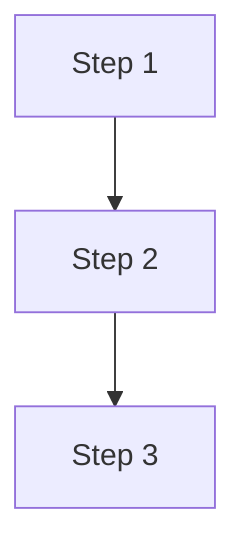

# Logic Chain Visualizer

Use this skill to turn a market narrative into a compact visual chain that
shows causal links, transmission paths, and second-order effects.

## When to use

- The user asks "why did this happen?" and the answer involves multiple linked
  effects.
- A macro or sector event needs a transmission-chain explanation.
- `market-report`, `news-intelligence`, or `earnings-readout` would benefit
  from a visual explanation rather than a dense paragraph.

## Workflow

1. Extract the core sequence of events or effects.
2. Reduce it to 3-8 nodes.
3. Use `logic_chain_visualizer` to render:
   - `nodes` plus optional labeled `edges`, or
   - `steps` if a simple linear chain is enough
4. Return the generated Markdown + Mermaid block together with a short plain
   language explanation.

## Output format

```md
# Logic Chain: <TITLE>

## Steps
- Step 1
- Step 2
- Step 3

## Diagram

```

## Rules

- Prefer fewer nodes over clutter.
- Keep node labels short and factual.
- Use labels on edges only when they add meaning.
- If the chain is speculative, say so explicitly outside the diagram.
