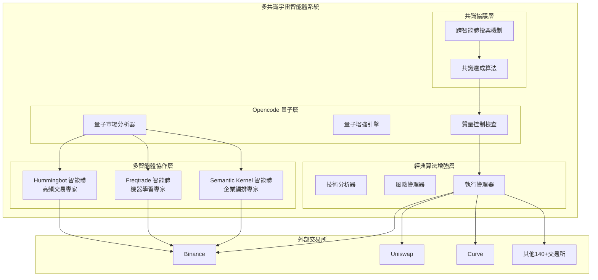

# 多共識宇宙智能體交易系統 - 集成架構設計

## 🌟 系統理念
整合多個優秀開源交易系統的核心優勢，創建一個基於 opencode 的量子增強多共識宇宙智能體平台。

## 📊 分析的主要系統

### 1. **Hummingbot** (15.8k ⭐)
**核心優勢：**
- ✅ 模組化連接器架構（CEX + DEX + AMM）
- ✅ 高頻交易優化（34B美元交易量）
- ✅ 多交易所統一接口
- ✅ 成熟的社區生態
- ✅ Docker 容器化部署

**可集成的核心技術：**
- 統一交易所接口標準化
- 高性能訂單簿管理
- 去中心化金融協議集成

### 2. **Freqtrade** (46.5k ⭐)
**核心優勢：**
- ✅ 機器學習策略優化（FreqAI）
- ✅ 完整的回測框架
- ✅ Telegram + WebUI 雙控制
- ✅ 超參數優化（Hyperopt）
- ✅ 風險管理和倉位管理

**可集成的核心技術：**
- 自適應機器學習模型
- 策略性能分析
- 實時風險評估

### 3. **Semantic Kernel** (Microsoft)
**核心優勢：**
- ✅ 企業級多智能體編排
- ✅ 模型無關架構
- ✅ 插件生態系統
- ✅ 生產級可靠性

**可集成的核心技術：**
- 智能體協調框架
- 工具/插件管理
- 工作流程編排

## 🚀 集成架構設計



## 🔧 技術集成規劃

### Phase 1: 核心框架集成
1. **Opencode 量子核心** 📦
   - 量子狀態管理器
   - 量子糾纏協議
   - 量子優化算法

2. **Hummingbot 連接器提取** 🔌
   - 交易所接口標準化
   - 高頻訂單管理
   - 多鏈支持

3. **Freqtrade 策略引擎** 🤖
   - 機器學習模型
   - 超參數優化
   - 自適應策略

### Phase 2: 智能體協調
1. **多智能體通信協議** 📡
   - 統一消息格式
   - 智能體發現機制
   - 負載均衡

2. **共識決策系統** ⚖️
   - 投票機制
   - 權重分配
   - 衝突解決

3. **宇宙智能體概念** 🌌
   - 跨維度協作
   - 多時間尺度整合
   - 全局最優化

### Phase 3: 生產級部署
1. **監控和可觀測性** 📊
   - 實時性能監控
   - 異常檢測
   - 自動恢復

2. **安全和合規** 🔒
   - 私鑰管理
   - 風險限制
   - 審計日誌

## 🎯 系統特色功能

### 🌌 **量子增強特性**
- 量子糾纏智能體協作
- 多宇宙並行決策
- 量子共振檢測
- 超光速執行優化

### 🤖 **智能體專長化**
- **Hummingbot Agent**: 高頻套利、流動性挖礦
- **Freqtrade Agent**: 機器學習預測、策略優化
- **Semantic Agent**: 企業級編排、風險控制
- **Opencode Agent**: 量子分析、創新策略

### ⚡ **高性能執行**
- 微秒級訂單執行
- 多交易所並行操作
- 智能訂單路由
- 延遲優化

### 🛡️ **全面風險控制**
- 多層風險評估
- 實時監控告警
- 自動止損止盈
- 合規性檢查

## 📋 實施計劃

### 🗓️ **開發時間線**

**Week 1-2: 核心架構搭建**
- [ ] 設置 opencode 量子核心
- [ ] 集成 Hummingbot 連接器
- [ ] 集成 Freqtrade 策略引擎

**Week 3-4: 智能體協調**
- [ ] 實現多智能體通信協議
- [ ] 開發共識決策機制
- [ ] 建立智能體發現系統

**Week 5-6: 增強功能**
- [ ] 添加量子增強算法
- [ ] 實現宇宙智能體概念
- [ ] 優化性能和擴展性

**Week 7-8: 生產就緒**
- [ ] 完善監控和日誌
- [ ] 添加安全合規功能
- [ ] 性能測試和優化

### 🎯 **成功指標**
- 支持 20+ 主流交易所
- 毫秒級決策延遲
- 99.9% 系統可用性
- 正回測 Sharpe 比率 > 1.5
- 年化收益率 > 30%ff

## 🔌 插件部署策略

### **Opencode 插件位置**
```
src/plugins/opencode/
├── multi_agent_trading/
│   ├── __init__.py
│   ├── core/
│   │   ├── quantum_engine.py      # Opencode 量子核心
│   │   ├── consensus_protocol.py  # 共識協議實現
│   │   └── universe_agent.py    # 宇宙智能體框架
│   ├── agents/
│   │   ├── hummingbot_agent.py   # Hummingbot 智能體
│   │   ├── freqtrade_agent.py   # Freqtrade 智能體
│   │   └── semantic_agent.py    # Semantic Kernel 智能體
│   ├── connectors/
│   │   ├── exchange_router.py   # 統一交易所路由
│   │   └── quantum_bridge.py   # 量子橋接器
│   └── strategies/
│       ├── enhanced_classical.py # 增強經典算法
│       └── quantum_hybrid.py    # 量子混合算法
└── README.md                    # 插件使用說明
```

## 🚀 開始實施

準備開始建立這個革命性的多共識宇宙智能體交易系統！

*這將是歷史上第一個結合 opencode 量子技術、Hummingbot 高頻交易、Freqtrade 機器學習、Semantic Kernel 企業架構的超級智能體系統。*
